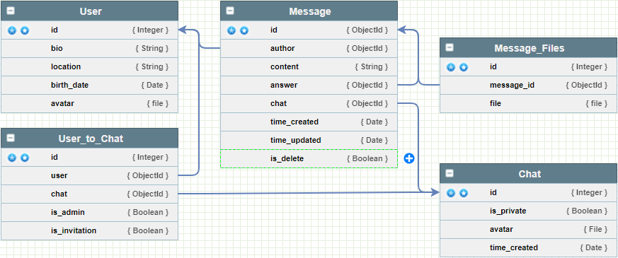

# Простой чат на Django Rest Framework

* Установка проекта
    1. По выбору: создать питоновское виртуальное окружение - python -m venv venv, активировать его:
        * `venv\Scripts\activate.bat` - для Windows
        * `source venv/bin/activate` - для Linux и MacOS
    2. клонировать этот репозиторий в понощью git - `git clone https://github.com/ShirServer/Simple_Chat_On_DRF.git`
    3. Установить зависимости - `pip install -r DRF_Chat_Api\requirements.txt`
    4. Создать таблицы - 
       * `cd DRF_Chat_Api`
       * `python manage.py makemigrations`
       * `python manage.py migrate`
    5. Создать суперпользователя -  `python manage.py createsuperuser`

* Архитектура базы данных:

  

* Roadmap
  * Создание чатов
  * Личные и не общественные чаты
  * Приглашение в общественные чаты
  * Администраторы чатов
  
  * Отправка сообщений
  * Изменение сообщений
  * Удаление сообщений
  * Создание приглашений в не приватный чат
  * приём или отказ от приглашения

* Цели проекта:
  * Практика

